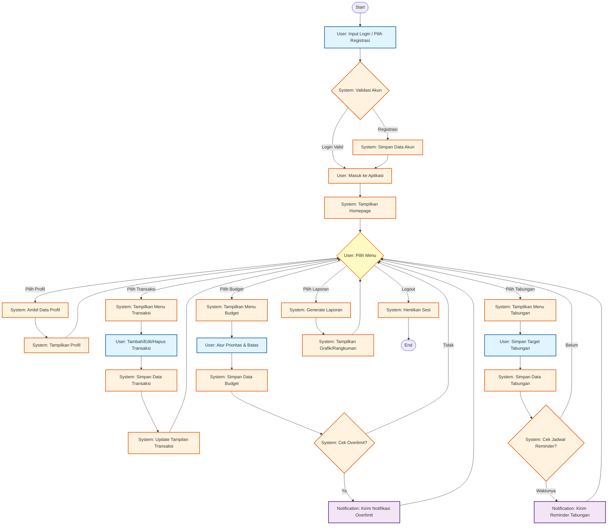

# Activity Diagram - Aplikasi Manajemen Keuangan

## Diagram Aktivitas

## Penjelasan Swimlane

### 🔵 User Actions (Biru)
- Input login/registrasi
- Pilih menu (Profil, Transaksi, Budget, Tabungan, Laporan)
- Tambah/Edit/Hapus data
- Atur prioritas dan batas budget
- Simpan target tabungan
- Logout

### 🟠 System Actions (Orange)
- Validasi akun
- Simpan data (akun, transaksi, budget, tabungan)
- Tampilkan halaman (Homepage, Profil, Menu)
- Update tampilan
- Cek kondisi (overlimit, jadwal reminder)
- Generate laporan
- Hentikan sesi

### 🟣 Notification Actions (Ungu)
- Kirim notifikasi overlimit budget
- Kirim reminder tabungan

## Alur Utama

1. **Login/Registrasi** → Validasi → Masuk ke aplikasi
2. **Homepage** → Pilih salah satu menu:
   - **Profil**: Lihat dan kelola profil pengguna
   - **Transaksi**: Tambah, edit, atau hapus transaksi keuangan
   - **Budget**: Atur budget dengan notifikasi overlimit
   - **Tabungan**: Set target dengan reminder otomatis
   - **Laporan**: Lihat grafik dan rangkuman keuangan
3. **Logout** → Keluar dari aplikasi

## Fork & Join Pattern

Diagram ini menggunakan pola **Fork-Join** di mana setelah masuk ke homepage, user dapat memilih berbagai menu (fork), dan setelah selesai dengan menu tersebut, kembali ke menu utama (join) untuk memilih menu lain atau logout.
