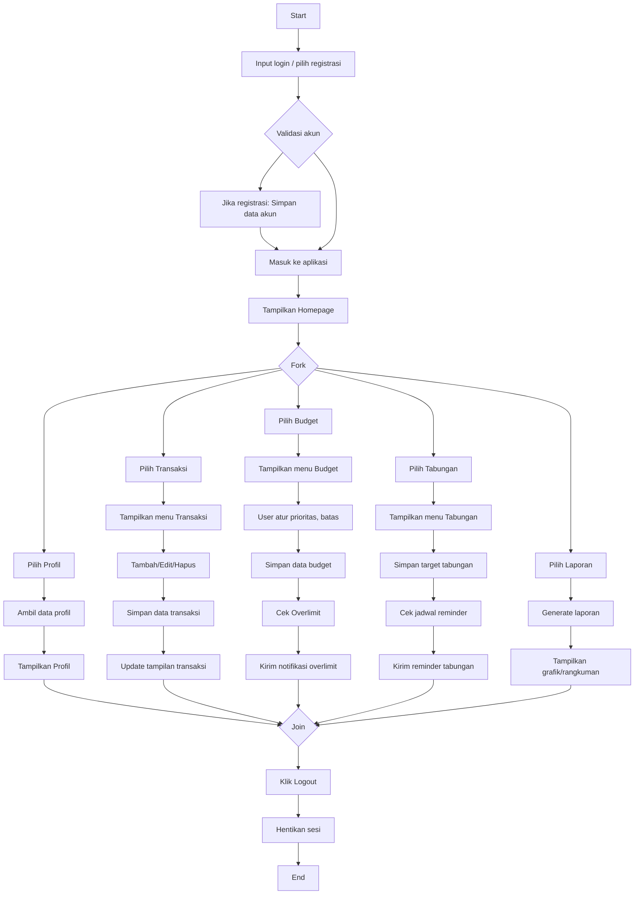

# Activity Diagram for Financial Management App

```mermaid
flowchart TD
    A[Start] --> B[Input login / pilih registrasi]
    B --> C{Validasi akun}
    C --> D[Jika registrasi: Simpan data akun]
    D --> E[Masuk ke aplikasi]
    C --> E
    E --> F[Tampilkan Homepage]
    F --> G{Fork}
    G --> H[Pilih Profil]
    H --> I[Ambil data profil]
    I --> J[Tampilkan Profil]
    J --> K{Join}
    G --> L[Pilih Transaksi]
    L --> M[Tampilkan menu Transaksi]
    M --> N[Tambah/Edit/Hapus]
    N --> O[Simpan data transaksi]
    O --> P[Update tampilan transaksi]
    P --> K
    G --> Q[Pilih Budget]
    Q --> R[Tampilkan menu Budget]
    R --> S[User atur prioritas, batas]
    S --> T[Simpan data budget]
    T --> U[Cek Overlimit]
    U --> V[Kirim notifikasi overlimit]
    V --> K
    G --> W[Pilih Tabungan]
    W --> X[Tampilkan menu Tabungan]
    X --> Y[Simpan target tabungan]
    Y --> Z[Cek jadwal reminder]
    Z --> AA[Kirim reminder tabungan]
    AA --> K
    G --> BB[Pilih Laporan]
    BB --> CC[Generate laporan]
    CC --> DD[Tampilkan grafik/rangkuman]
    DD --> K
    K --> EE[Klik Logout]
    EE --> FF[Hentikan sesi]
    FF --> GG[End]
```